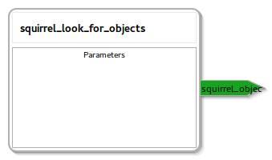

squirrel_object_perception
====================

General description
---------------------
The squirrel_object_perception package

Node: squirrel_look_for_objects
---------------------
#### Parameters

#### Provides Actionserver
squirrel_object_perception

#### Subscribed Topics
/camera/depth_registered/points

#### Service dependencies
/squirrel_attention_3Dsymmetry
/squirrel_attention_color
/squirrel_attention_height
/squirrel_attention_itti
/squirrel_attention_location
/squirrel_attention_surfaceorientation
/squirrel_attention_symmetry
/squirrel_look_for_objects/set_parameters
/squirrel_segmentation_incremental_init
/squirrel_segmentation_incremental_once
/squirrel_segmentation_visualization_init
/squirrel_segmentation_visualization_once
