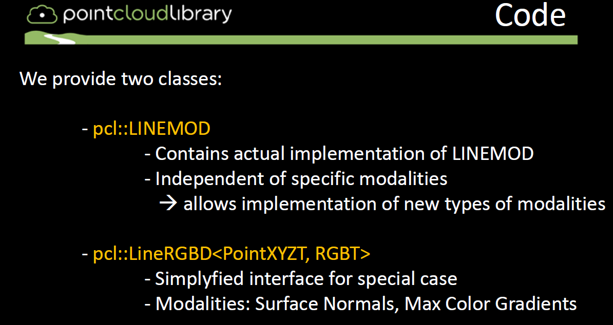
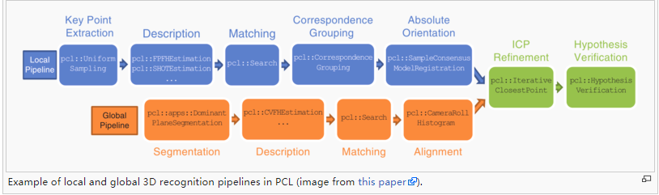

----------------------

# 记录：

1.温伯文-CVPR2024满分论文！即插即用的6D物体姿态估计大模型 FoundationPose ( BOP排行榜第一名算法)  https://github.com/NVlabs/FoundationPose

2.https://github.com/NVlabs/diff-dope 英伟达位姿态优化器，一个 6-DoF 姿态细化器，将图像、3D 模型和初始对象姿态作为输入。然后，该方法使用可微渲染器输出对象的姿态，该渲染器最大限度地减少对象重投影误差（RGB、深度、边缘、掩模等）。 

3.https://github.com/nv-nguyen/gigapose 模版匹配

-------------

# TOO OLD
**物体检测与位姿估计**

针对刚性物体识别与位姿估计的方法主要分为三类：

- 基于模板匹配
- 基于三维局部特征
- 基于学习

<!--more-->

[资料整理](<https://github.com/littlebearsama/ObjectDetection>)

## 0.相关

1. 网站：[Detection and 6D Pose Estimation](<http://rkouskou.gitlab.io/research/6D_Object.html>)里面收录了很多文章和方法
2. 没趣啊知乎：[meiqua知乎](<https://zhuanlan.zhihu.com/p/35638736>)
3. 石头哥的目标检测(深度学习)笔记 [stone](<https://github.com/mensaochun/AwesomeDeepLearning/tree/master/ObjectDetection/summary>)

## 1.基于模板匹配(template matching)

基于模板匹配的6D目标位姿估计方法的研究始于20世纪90年代的单目图像。

**以不同视点下目标对象的整体外观作为模型模板**，

### A.2D

基于线条特征[^3]、边缘轮廓[^4]、冲击图形和曲线[^5]进行模型与输入的匹配。

可用的开源项目：

1. [shape_based_matching](<https://github.com/meiqua/shape_based_matching>)
2. [edge_based_matching](<https://sourceforge.net/p/vision-for-vs/svn/102/tree/branches/edge_based_matching/>)
3. [ShapeMatch](<https://github.com/dmccskylove/ShapeMatch>)
4. [LINE2D](<https://github.com/imbinwang/LINE2D>)
5. [OpenSSE](<https://github.com/zddhub/opensse>)

### B.2.5D

在增加了深度信息后，使得6D目标位姿估计对背景杂波具有更强的鲁棒性。针对机器人应用提出了快速、鲁棒的RGB-D特性，

如VFH[6]和CVFH[7]。stoisser等[8,9]提出了以图像梯度离散化方向和表面法线为特征的linemod方法。相似度得分在预先计算的响应图上快速计算出来，他们表明它比现有的方法在杂乱的背景下更健壮，也更快。

开源项目linemod(opencv和PCL中均有接口)：

1. [6DPose](<https://github.com/meiqua/6DPose>)
2. PCL提供两个类LINEMOD和lineRGBD

## 2.基于三维局部特征(3D local features)

在基于三维局部特征的方法中，六自由度位姿是根据**局部特征的对应关系**或**Hough投票中恢复**出来的。

早期提出了二维图像中提取的线条特征[^10]、边缘特征[^11]等多种局部特征。为了进行更稳健的估计，还提出了利用深度信息的局部描述符，如自旋图像[^12]和SHOT[^13]。

点对特性(PPF)[^14]是迄今为止最为成功和著名的三维局部描述符，并且已经提出了许多扩展版本。例如，选择边界或线[^15]点，计算分割点云[^16]上的PPF，改进点采样和投票[^17]。然而，与基于模板的方法相比，在6D位姿空间中进行模式搜索速度较慢。

（论文**BOP: Benchmark for 6D Object Pose Estimation** 中对15种方法进行了评估，得出结论是PPF表现最好，优于模板匹配方法（templates matching），基于学习（learning-based）的方法和基于3D local features的方法）

### 1.基于点云三维局部特征的方法3D local features

一般点云物体识别的流程是：

1. 提取关键点（keypoints）。比如iss关键点，sift关键点。它们的数据形式是三维向量XYZ+其他信息
2. 利用关键点keypoints作为种子计算特征描述子descriptors。比如3DSC描述子，LSP描述子。它们的数据形式是多维向量比如PFH的长度是125，SI的长度是225。
3. 匹配：实际上是通过特征描述子（descriptors）进行对应点（correspondence）估计。如SAC-IA算法。
4. 匹配后再通过一些点云的配准（registration）方法比如迭代最近点（ICP）进行精确配准。
5. 假设验证

使用PCL中的方法：

[3D_object_recognition_(pipeline)](<http://robotica.unileon.es/index.php/PCL/OpenNI_tutorial_5:_3D_object_recognition_(pipeline)>)

### 2.PPF vote-based pose estimation.（基于投票的位姿估计）

典型方法：PPF 

OPENCV和PCL中均有接口

hough transform霍夫变换

hough random forests霍夫随机森林

## 3.基于学习(learning-based)   

在基于学习的方法中，出现了很多利用**机器学习**技术提取识别特征，训练识别前景/背景、对象类和三维对象姿态的分类器。例如，学习模板匹配[^18]或投票[^19]的权重，学习潜在类分布[^20]和学习霍夫森林进行坐标回归[^21]。近年来，CNN被引入学习三维物体姿态[^22]的流形。提出了基于卷积自动编码器[^23]和自监督增强自动编码器[^24]的流形学习方法。Kehl等人提出了类似ssd的CNN架构，用于估计对象的二维位置、类和三维位姿。利用基于CNN的检测器检测三维控制点或包围盒角的投影二维点，而不是估计三维位姿类[^25,26,27]。虽然最近的基于CNN的方法与其他两种方法相比，对背景杂波和局部遮挡的鲁棒性更高，但是它们的训练需要大量的带注释的训练样本，并且在GPU上花费更长的时间。

### **1.3D-Machine-Learning**

[3D-Machine-Learning](<https://github.com/timzhang642/3D-Machine-Learning>)

- [Datasets](https://github.com/timzhang642/3D-Machine-Learning#datasets)
- [3D Pose Estimation](https://github.com/timzhang642/3D-Machine-Learning#pose_estimation)
- [Courses](https://github.com/timzhang642/3D-Machine-Learning#courses)
- [Single Object Classification](https://github.com/timzhang642/3D-Machine-Learning#single_classification)
- [Multiple Objects Detection](https://github.com/timzhang642/3D-Machine-Learning#multiple_detection)
- [Scene/Object Semantic Segmentation](https://github.com/timzhang642/3D-Machine-Learning#segmentation)
- [3D Geometry Synthesis/Reconstruction](https://github.com/timzhang642/3D-Machine-Learning#3d_synthesis)
- [Texture/Material Analysis and Synthesis](https://github.com/timzhang642/3D-Machine-Learning#material_synthesis)
- [Style Learning and Transfer](https://github.com/timzhang642/3D-Machine-Learning#style_transfer)
- [Scene Synthesis/Reconstruction](https://github.com/timzhang642/3D-Machine-Learning#scene_synthesis)
- [Scene Understanding](https://github.com/timzhang642/3D-Machine-Learning#scene_understanding)

### 2.A Tutorial on 3D Deep Learning

[A Tutorial on 3D Deep Learning](<http://3ddl.stanford.edu/>)

### 3.3D Convolutional Neural Networks — A Reading List

[3D Convolutional Neural Networks — A Reading List](<http://davidstutz.de/3d-convolutional-neural-networks-a-reading-list/>)

### 4.3D_Deep_Learning_opensource
#### 未开源：
1. Mesh R-CNN <https://arxiv.org/abs/1906.01140>

   TLNet：从单目到立体3D目标检测
   《Triangulation Learning Network: from Monocular to Stereo 3D Object Detection》(CVPR2019)
   论文：https://arxiv.org/abs/1906.01193

2. 基于RGB和LiDAR融合的自动驾驶3D语义分割
   《RGB and LiDAR fusion based 3D Semantic Segmentation for Autonomous Driving》

   https://arxiv.org/abs/1906.00208

3. 轻量级3D卷积网络，用于视频识别

   https://arxiv.org/abs/1905.13388

4. MonoDIS ：解构单目3D物体检测
   《Disentangling Monocular 3D Object Detection》

   论文：https://arxiv.org/abs/1905.12365

   主页：https://research.mapillary.com/publication/MonoDIS/

5. Shift R-CNN：具有闭式几何约束的深度单目3D目标检测
   《Shift R-CNN: Deep Monocular 3D Object Detection with Closed-Form Geometric Constraints》（ICIP 2019）

   论文：<https://arxiv.org/abs/1905.09970>

6. PoseRBPF：用于6D目标姿态跟踪的Rao-Blackwellized粒子滤波器

   论文：https://arxiv.org/abs/1905.09304

7. MonoDIS ：解构单目3D物体检测
   《Disentangling Monocular 3D Object Detection》

   主页：https://research.mapillary.com/publication/MonoDIS/

   论文：https://arxiv.org/abs/1905.12365

8. 关键点几何推理的单目 3D 物体检测
   《Monocular 3D Object Detection via Geometric Reasoning on Keypoints》

   论文：https://arxiv.org/abs/1905.05618

9. 利用高分辨率传感器标记数据训用于LiDAR距离的快速目标检测器
   《Training a Fast Object Detector for LiDAR Range Images Using Labeled Data from Sensors with Higher Resolution》

   论文：https://arxiv.org/abs/1905.03066

10. 用于3D目标检测和语义分割的传感器融合
    《Sensor Fusion for Joint 3D Object Detection and Semantic Segmentation》

    论文：https://arxiv.org/abs/1904.11466

11. RGB-D数据的可转移半监督3D目标检测
    《Transferable Semi-supervised 3D Object Detection from RGB-D Data》

    论文：https://arxiv.org/abs/1904.10300

12. 用于点云中3D目标检测的Hough Voting
    《Deep Hough Voting for 3D Object Detection in Point Clouds》

    论文：https://arxiv.org/abs/1904.09664

13. 学习2D到3D提升用于自动驾驶的3D目标检测
    《Learning 2D to 3D Lifting for Object Detection in 3D for Autonomous Vehicles》

    https://arxiv.org/abs/1904.08494

14. Complexer-YOLO：语义点云上的实时3D目标检测和跟踪
    《Complexer-YOLO: Real-Time 3D Object Detection and Tracking on Semantic Point Clouds》

    https://arxiv.org/abs/1904.07537

15. FVNet：用于从点云进行实时目标检测的3D前视图建议生成
    《FVNet: 3D Front-View Proposal Generation for Real-Time Object Detection from Point Clouds》

    https://arxiv.org/abs/1903.10750

16. 伪LiDAR点云的单目3D目标检测
    《Monocular 3D Object Detection with Pseudo-LiDAR Point Cloud》

    https://arxiv.org/abs/1903.09847

17. LaserNet：一种用于自主驾驶的高效概率 3D目标检测器

    https://arxiv.org/abs/1903.08701

18. 基于立体R-CNN的3D目标检测
    《Stereo R-CNN based 3D Object Detection for Autonomous Driving》

    https://arxiv.org/abs/1902.09738

19. IXOR：点云的实时3D目标检测
    《PIXOR: Real-time 3D Object Detection from Point Clouds》

    https://arxiv.org/abs/1902.06326

    

#### 开源

1. . 3D-BoNet：学习点云上3D实例分割的目标边界框
   《Learning Object Bounding Boxes for 3D Instance Segmentation on Point Clouds》

   论文：https://arxiv.org/abs/1906.01140

   github：<https://github.com/Yang7879/3D-BoNet>

2. 联合单目3D车辆检测与跟踪

   github：https://github.com/ucbdrive/3d-vehicle-tracking

3. PointRCNN+Frustum Pointnet

   github：https://github.com/JenningsL/PointRCNN

4. 3D BAT：基于Web的3D标注工具（3D Box）
   《3D BAT: A Semi-Automatic, Web-based 3D Annotation Toolbox for Full-Surround, Multi-Modal Data Streams》

   论文：https://arxiv.org/abs/1905.00525

   github：https://github.com/walzimmer/3d-bat

5. FANTrack：具有特征关联网络的3D多目标跟踪
   《FANTrack: 3D Multi-Object Tracking with Feature Association Network》IEEE Intelligent Vehicles Symposium (IV 19)

   论文：https://arxiv.org/abs/1905.02843

   github：https://git.uwaterloo.ca/wise-lab/fantrack

   

6. CenterNet：将目标视为点
   《Objects as Points》

   论文：https://arxiv.org/abs/1904.07850

   github:https://github.com/xingyizhou/CenterNet

   github:https://github.com/see--/keras-centernet

   youtube:https://www.youtube.com/watch?v=M63gSMdco2c&feature=youtu.be

7. DISN：用于高质量单视图三维重建的深层隐式曲面网络
   《DISN: Deep Implicit Surface Network for High-quality Single-view 3D Reconstruction》

   论文：https://arxiv.org/abs/1905.10711

   github：https://github.com/laughtervv/DISN
   
8. （3D目标检测）Pseudo-LiDAR++：自主驾驶中3D目标检测的精确深度

   论文：https://arxiv.org/abs/1906.06310
   
   github：https://github.com/mileyan/Pseudo_Lidar_V2
